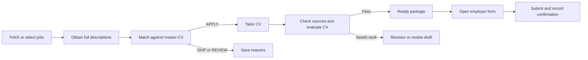

# OpenAI application mode

This mode collects job listings, checks them against your master CV and preferences,
creates a tailored CV for suitable roles, evaluates the new document, and saves an
application package. A separate command opens the employer form and can assist
with submission. You can start using it without training the local classifiers.



The master CV supplies the facts. Generated text must cite quotations from it;
unknown experience, qualifications, work authorization and personal answers are
not filled in by assumption. Numerical scores are internal evaluation rubrics,
not employer ATS scores or promises of an interview.

For the other workflow, return to the [main README](../README.md). This guide
covers the OpenAI CLI in [scripts/apply_jobs.py](../scripts/apply_jobs.py).

## 1. Install from a fresh clone

The commands below use a Linux/macOS-style shell and run from the repository
root. This repository is private; your GitHub account and SSH key need access.

```bash
git clone git@github.com:idj997/Job_Application_Agent.git
cd Job_Application_Agent
python3 -m venv .venv
.venv/bin/python -m pip install -r requirements-openai.txt
```

Use a recent Python version; the application tests have run on Python 3.14 in
the development workspace. Dependencies for this mode are listed separately in
[requirements-openai.txt](../requirements-openai.txt); the local model and
training stack is not required. On Windows, use the corresponding virtual
environment executable, usually `.venv\Scripts\python.exe`.

Install Chromium if you intend to use the application browser:

```bash
PLAYWRIGHT_BROWSERS_PATH="$PWD/.venv/playwright-browsers" .venv/bin/python -m playwright install chromium
```

The application automatically uses `.venv/playwright-browsers` when that directory
exists, unless you explicitly set `PLAYWRIGHT_BROWSERS_PATH` yourself. The `open`
command launches a visible browser and needs a graphical desktop. Fetching jobs,
preparing CVs and inspecting saved results can run without a desktop.

### Configure OpenAI and source credentials

Create a configuration file only if you do not already have one:

```bash
if [ ! -e .env ]; then
    cp .env.example .env
fi
```

Edit `.env` and add or update the OpenAI entries. Preserve your existing job
source credentials and local model settings.

```dotenv
OPENAI_API_KEY=replace_with_your_api_key
OPENAI_MODEL=gpt-5-mini
OPENAI_MAX_OUTPUT_TOKENS=6000
```

`gpt-5-mini` is an example model with Responses and Structured Outputs support.
Your API project must have access to the model you configure. You can select
another compatible model with `OPENAI_MODEL` or the `prepare --model` option.
There is no hardcoded model fallback when configuration is missing.
[Official model documentation](https://developers.openai.com/api/docs/models/gpt-5-mini).

Environment variables already exported in your shell take precedence over `.env`.
Do not put an API key in a job file, candidate profile, README or command-line
argument. The application reads it through the environment.

Check the installation:

```bash
.venv/bin/python app.py doctor
```

`doctor` reports installed Python modules and whether `OPENAI_API_KEY` and
`OPENAI_MODEL` are set. It does not display their values, call the API, validate
account billing/model access, or launch Chromium. Its exit code reflects missing
Python dependencies; also read the configuration lines it prints.

## 2. Add your CV and profile

Keep a complete, accurate master CV with your name, current contact details,
employment history, dates, qualifications, projects and supported achievements.
The generated CV cannot responsibly add facts absent from this source.

```bash
mkdir -p data/cv
if [ ! -e config/candidate_profile.json ]; then
    cp config/candidate_profile.example.json config/candidate_profile.json
fi
```

Save your own master CV as `data/cv/master.pdf`, or choose another supported path.
Accepted formats are text-based PDF, DOCX, UTF-8 text (`.txt`) and Markdown
(`.md`). Scanned/image-only PDFs need OCR or a text-based export first. The reader
limits source files to 10 MiB, extracted text to 100,000 characters, PDFs to 50
pages and expanded DOCX content to 50 MiB. Password-protected PDFs are rejected.

Edit `config/candidate_profile.json` using your real details. This example is
fictional and illustrates the format:

```json
{
  "cv_path": "../data/cv/master.pdf",
  "name": "Alex Example",
  "first_name": "Alex",
  "last_name": "Example",
  "email": "alex@example.com",
  "phone": "+44 7700 900000",
  "location": "London",
  "preferences": {
    "target_roles": ["Data Engineer", "Analytics Engineer"],
    "locations": ["London", "United Kingdom"],
    "work_patterns": ["remote", "hybrid"],
    "minimum_salary": 45000,
    "salary_currency": "GBP",
    "requires_sponsorship": null,
    "hard_constraints": []
  }
}
```

The profile must be valid JSON: use double quotes, `null` for an unknown optional
value and no comments or trailing commas. Unknown keys are rejected to catch
configuration mistakes.

| Field | Meaning |
| --- | --- |
| `cv_path` | Master CV path. A relative value is resolved against the profile file's directory. `--cv` overrides it and resolves against the shell's working directory. |
| `name` | Explicit full name for recognized Lever forms. It is not assembled from the first/last-name fields. |
| `first_name`, `last_name` | Explicit names for recognized Greenhouse forms. They are not guessed from `name`. |
| `email`, `phone` | Contact values for recognized browser fields. Keep them consistent with the master CV. |
| `location` | Saved candidate location. It does not replace `preferences.locations` or the discovery `--location`, and is not currently autofilled into custom form controls. |
| `preferences.target_roles` | Acceptable roles used as a matching constraint. During `--fetch`, the first entry supplies the query if `--query` is omitted. |
| `preferences.locations` | Acceptable work locations, checked against the job description. |
| `preferences.work_patterns` | Any combination of `remote`, `hybrid`, `onsite`. An empty list adds no work-pattern constraint. |
| `preferences.minimum_salary` | Minimum annual salary in `salary_currency`; `null` disables the salary constraint. |
| `preferences.salary_currency` | Currency label used in the salary requirement; default `GBP`. The application has no exchange-rate conversion service. |
| `preferences.requires_sponsorship` | `true` requires explicit suitable sponsorship from the employer. `false` and `null` add no sponsorship constraint; neither certifies work authorization. |
| `preferences.hard_constraints` | Extra conditions you want checked individually, expressed as strings. Unknown evidence can send the role to REVIEW. |

Empty preference lists add no constraints of that kind. If you set a minimum
salary, missing or ambiguous pay, a predicted salary, missing currency or an
unclear pay period is treated as unknown. If sponsorship is required but the
advertisement does not explicitly address it, the role goes to REVIEW. These
settings can substantially reduce the number of automatic APPLY verdicts; set
them to reflect requirements you actually have.

Profile contact fields support browser autofill. CV generation still uses the
master CV as its factual source. The browser does not extract missing contact
fields from your CV, and it does not answer eligibility or custom questions from
the preferences object.

You can omit the profile and use `--cv` directly. This uses an empty set of
preferences and leaves browser contact fields for you to complete:

```bash
.venv/bin/python app.py prepare --cv data/cv/master.pdf --limit 1 --dry-run
```

## 3. Preview and prepare jobs

Start with a small batch:

```bash
.venv/bin/python app.py prepare --profile config/candidate_profile.json --limit 3 --dry-run
.venv/bin/python app.py prepare --profile config/candidate_profile.json --limit 3
```

A dry run loads the profile and CV and previews the job count, constraints and
maximum logical model calls. It makes no network requests or model calls and
writes no application artifacts. It does not verify that an employer page is
reachable or that your API key/model can make a successful request.

An ordinary preparation run requires OpenAI configuration, including when its
eventual results are cached or marked REVIEW without model calls. The inspection
and browser commands do not use the OpenAI provider.

### Use previously collected jobs

With no `--job`, `--url` or `--fetch`, preparation reads JSON job records from
`data/processed_jobs`, newest file modification time first. A fresh clone may
have no collected jobs; use one of the discovery or URL commands below.

```bash
.venv/bin/python app.py prepare --profile config/candidate_profile.json --jobs-dir data/processed_jobs --limit 5
.venv/bin/python app.py prepare --profile config/candidate_profile.json --job data/processed_jobs/JOB_ID.json --limit 1
```

`--job` is repeatable. Explicit files are processed in the order supplied. Each
must contain one JSON job object with a title, description and HTTP(S) source URL;
use the output of the existing collectors when possible. Invalid files are
reported and skipped.

### Start from an employer URL

Replace the sample company and job identifier with a real posting:

```bash
.venv/bin/python app.py prepare --profile config/candidate_profile.json --url "https://jobs.lever.co/COMPANY/JOB_ID" --limit 1
```

`--url` is repeatable. Explicit URLs exclude the default directory selection.
You can combine explicit `--job` and `--url` values; the explicit job files take
the earlier batch slots. The total preparation limit still applies.

URL retrieval uses the existing JSON-LD/HTML extractors, with a DWP-specific
extractor on DWP pages. It does not execute JavaScript or log in. Direct
retrieval validates public HTTP(S) destinations on every redirect, pins the
validated network address, limits redirects and bounds the response size.
Pages requiring an interactive browser may need a manually saved description.

### Fetch and prepare in one command

```bash
.venv/bin/python app.py prepare --profile config/candidate_profile.json --fetch --sources adzuna --query "data engineer" --location "United Kingdom" --limit 5
```

The application reuses `JobCollectionService` and the existing source adapters.
With `--fetch`, `--limit` is both the discovery limit per source and the maximum
number of jobs prepared overall. For example, two sources with `--limit 5` can
save up to five jobs each, while preparing up to five available records.

| Source | Configuration for this command |
| --- | --- |
| `adzuna` | Set `ADZUNA_APP_ID` and `ADZUNA_APP_KEY` in `.env`. Uses the UK adapter configuration. Descriptions are summaries and require enrichment. |
| `greenhouse` | Pass `--board-token COMPANY_TOKEN` or set `GREENHOUSE_BOARD_TOKEN`. `GREENHOUSE_COMPANY` can supply the company label. |
| `lever` | Pass `--company-slug COMPANY_SLUG` or set `LEVER_COMPANY_SLUG`. `LEVER_COMPANY` can supply the company label. |
| `arbeitnow` | No API key is configured by this adapter. Job availability and filtering depend on the feed. |
| `the_muse` | `THE_MUSE_API_KEY` is optional in the adapter. |
| `remotive` | No API key is configured by this adapter. This source supplies remote listings. |

Examples:

```bash
.venv/bin/python app.py prepare --profile config/candidate_profile.json --fetch --sources greenhouse --board-token COMPANY_TOKEN --query "data engineer" --location "" --limit 3
.venv/bin/python app.py prepare --profile config/candidate_profile.json --fetch --sources lever --company-slug COMPANY_SLUG --query "data engineer" --location "" --limit 3
.venv/bin/python app.py prepare --profile config/candidate_profile.json --fetch --sources arbeitnow remotive --query "python" --location "United Kingdom" --limit 3
```

The discovery query comes from `--query` or the first profile target role. Supply
one even when collecting a specific company board. `--location` is a discovery
filter, defaults to `United Kingdom` and is interpreted by each source; it is
separate from the matching constraints in the profile. Broader source-specific
filters, including Lever's region option, are available through the existing
`scripts.scrape_jobs` command; collect there and then prepare the stored records.
The company-board examples use `--location ""` to omit the discovery location
filter; many boards list a city without a country name. Profile location
constraints are still checked during matching.

Discovery writes raw records under the application's output directory and
processed records to `--jobs-dir`. The preparation batch then selects the newest
available records from that directory. It can include older records if discovery
saves fewer new jobs than the batch limit. It does not continuously search or
run on a schedule. `--fetch` cannot be combined with explicit `--job` or `--url`.

### Supply a full description when a source has only a summary

Adzuna summaries are enriched from the linked page before matching. The original
record and identity are preserved; a successful enrichment records the full
description URL in metadata. Same-summary results, apparent truncation, a changed
role/employer or an inaccessible page keep the job in REVIEW.

Save the complete employer description as UTF-8 `.txt` or `.md` and target one
job explicitly:

```bash
.venv/bin/python app.py prepare --profile config/candidate_profile.json --job data/processed_jobs/JOB_ID.json --description-file data/cv/job-description.txt --limit 1
```

`--description-file` requires exactly one `--job` or `--url`; it cannot accompany
a discovery batch. The file is limited to 250 KB. Completeness checks are
heuristics: short descriptions, trailing truncation markers or text that adds
little beyond the source summary can still require review. Do not add invented
content just to pass a length check.

With `--url`, the page must still yield a title and initial job record before
the description override is applied. If the page cannot be extracted at all,
save a small job JSON file yourself with the real title, employer and URL, for
example `data/processed_jobs/manual-job.json`:

```bash
mkdir -p data/processed_jobs
```

```json
{
  "title": "Data Engineer",
  "company": "Employer Name",
  "location": "London",
  "source": "manual",
  "source_url": "https://EMPLOYER_DOMAIN/jobs/JOB_ID",
  "description": "Short description copied from the employer listing.",
  "metadata": {
    "description_type": "summary"
  }
}
```

Then prepare the saved record:

```bash
.venv/bin/python app.py prepare --profile config/candidate_profile.json --job data/processed_jobs/manual-job.json --description-file data/cv/job-description.txt --limit 1
```

If the source URL is an aggregator and you already
know the correct employer application URL, a verified `metadata.apply_url` in
the job JSON can identify it. Otherwise the browser uses the enriched full
description URL, then the canonical/source URL.

To avoid enrichment requests altogether:

```bash
.venv/bin/python app.py prepare --profile config/candidate_profile.json --limit 5 --no-enrich
```

Summary-only jobs then go to REVIEW without a model call. This flag does not
disable explicit URL retrieval or discovery requested by `--url`/`--fetch`.

## 4. Understand decisions and generated files

### Match verdict

Matching returns structured requirements, importance, status, job evidence and
CV evidence. The application checks evidence quotations against the supplied
text after normalizing whitespace. A quotation check establishes that the text
exists; the model is still responsible for interpreting whether it supports the
claim.

The score is calculated in code:

```text
match score = round(100 × sum(requirement weight × credit) / sum(requirement weight))
```

| Requirement importance | Weight |
| --- | ---: |
| CORE: explicitly mandatory | 5 |
| IMPORTANT: expected for the role | 3 |
| PREFERRED: desirable | 1 |
| CONTEXTUAL / NOT_REQUIREMENT | 0 |

MET earns `1`, PARTIAL `0.5`, and MISSING/UNKNOWN `0`. Acceptable alternatives
such as “Python or Java” are prompted as one grouped requirement. Zero total
weight, duplicate requirements, unverified evidence, an incomplete description
or missing constraint checks lead to REVIEW.

After those validation checks, explicit failed constraints produce SKIP.
Unknown constraints and any CORE requirement not fully MET produce REVIEW.
The model must also recommend APPLY and the score must meet `--match-threshold`
(default `70`). A high numerical score cannot override a failed or unresolved
mandatory check. Lowering the threshold does not disable these checks.

### CV generation and evaluation

Only an APPLY verdict triggers tailoring. The model creates structured CV
sections with evidence quotations from the master CV. A separate request audits
the complete proposed CV against the job and master CV for unsupported claims,
missing critical information, coverage and clarity. It uses the configured
model again, rather than a separately configured evaluator model.

```text
CV quality score = round(0.7 × requirement coverage + 0.3 × clarity)
```

The default `--cv-threshold` is `75`. Ready status also requires valid source
quotations, factual consistency, no unsupported claims and no missing critical
information reported by the audit. Those conditions apply regardless of score.
Source checks and model audits can miss problems; read the generated document
before using it.

`--max-revisions 1` means one initial draft and at most one revised draft. Allowed
values are `0`, `1`, `2`; each revision reruns generation and evaluation. After
the budget is exhausted, a document needing correction is saved as a REVIEW
draft when export succeeds. The master CV is never rewritten by preparation.

### Artifacts and states

The default output layout is:

```text
data/applications/
├── applications.db                  # Authoritative application ledger
├── applications.html                # Local dashboard with document links
├── raw_jobs/                        # Raw discoveries from --fetch
└── JOB_KEY/
    └── PREPARATION_ID/
        ├── cv.pdf
        ├── cv.docx
        ├── cv.md
        └── assessment.json          # Preparation snapshot and evidence
```

A skipped job, an incomplete-description review or a failure before export may
have only a ledger record. A ready package or exported review draft has the
document files. Later browser outcomes update the ledger; `assessment.json`
remains a snapshot of preparation. Use `list`/`show` to inspect the current state.

| State | Meaning and next action |
| --- | --- |
| `ready` | Matching, tailoring and evaluation passed. Review the package, then open it. |
| `review` | The match or generated CV needs attention. Read the reasons; supply missing facts or a full description before retrying. |
| `skipped` | A validated mismatch or score below the match threshold. No tailored CV is produced. |
| `failed` | Preparation encountered an API, configuration or document error. Correct the cause and prepare again. |
| `opened` | A browser session was claimed. Its outcome must be confirmed or resolved before reopening. |
| `submitted` | An employer receipt was detected or you recorded a verified confirmation. Further attempts are blocked. |
| `submission_unknown` | A protected uncertain outcome, if present in the ledger. Verify the employer's state before any retry. |

The browser can report an unknown submission outcome while the CLI ledger still
shows `opened` with `submission_attempted=true`. Both require the same explicit
outcome check; an absent receipt is not proof that no application was submitted.

## 5. Review and apply

```bash
.venv/bin/python app.py list
.venv/bin/python app.py show APPLICATION_ID
.venv/bin/python app.py open APPLICATION_ID
```

Use the short ID printed by `list` or a longer unique prefix. Open the dashboard
file `data/applications/applications.html` in your browser to follow the saved
PDF, DOCX and assessment links.

`open` requires a ready record and the saved PDF. It atomically records a browser
attempt before launch so another process cannot independently open the same
ready application. The visible browser stays open until you close it.

On recognized forms, the browser fills known contact fields and uploads the
generated PDF. Review those fields, answer additional questions, submit manually
when ready, and close the browser. A new browser context is created for each
session; saved logins or reusable authentication profiles are not implemented.

### Supported form assistance

| Platform | Supported HTTPS hosts | Automatic fields |
| --- | --- | --- |
| Greenhouse | `boards.greenhouse.io`, `job-boards.greenhouse.io`, `boards.eu.greenhouse.io`, `job-boards.eu.greenhouse.io` | First name, last name, email, optional phone; recognized resume upload. |
| Lever | `jobs.lever.co`, `jobs.eu.lever.co` | Full name, email, optional phone; recognized resume upload. |
| Other public employer pages | Opened for manual completion. | No generic form-field guessing. |

Lever posting URLs are advanced to their `/apply` form. Recognized hostnames do
not guarantee that a particular form layout is supported: assistance relies on
specific known fields and controls. A changed employer/vacancy destination is
left for manual checking rather than automatically receiving your CV.

To request automatic submission of a supported simple form:

```bash
.venv/bin/python app.py open APPLICATION_ID --submit
```

Automatic submission requires the expected name/email controls, successful CV
upload, valid required fields and a single recognized control labelled “Submit
application.” CAPTCHA/verification, custom questions, unknown controls or
unrecognized layouts leave the form open for manual completion. Even optional
custom controls can block automatic submission. The flag is evaluated during
initial preparation of the page; if you later fill custom questions, submit
manually in the open browser.

Embedded forms and custom career sites may need manual uploads and answers.
LinkedIn Easy Apply automation, account creation, generalized AI browser control
and automatic responses to arbitrary application questions are not implemented.
The OpenAI model is used for matching and CV preparation; browser actions use
the code's existing selectors and your explicit profile values.

### Confirm or resolve the outcome

For supported pages, the browser checks for a visible application receipt on
the expected ATS. A URL change alone is not treated as confirmation. If the
receipt is detected, the CLI records it after the browser session ends.

If you submitted manually and verified a confirmation that was not detected:

```bash
.venv/bin/python app.py mark-submitted APPLICATION_ID --confirmation "Employer portal receipt/reference that I verified"
```

If you closed the browser without applying, it could not start, or a request
failed, check the employer portal or confirmation email first. When you have
established that nothing was submitted, release the attempt with a useful note:

```bash
.venv/bin/python app.py resolve-not-submitted APPLICATION_ID --note "Checked the employer portal: application is still a draft and was not submitted"
.venv/bin/python app.py open APPLICATION_ID
```

Resolution returns an opened/uncertain record to ready and retains a history of
the check. Confirmed submissions cannot be reset. Do not delete the database to
bypass an uncertain outcome: that removes the duplicate-attempt protection.

Job identity uses employer plus requisition ID when available, otherwise a
normalized application/source URL, with tracking parameters removed and Lever
posting/application URLs normalized together. Source plus external ID is a
fallback for programmatic records. Different boards can still represent one
vacancy under different identifiers, so check for those duplicates yourself.
Use one ledger for one candidate.

## 6. Batches, caching, cost and privacy

The default preparation batch is five jobs; `--limit` accepts `1` through `100`.
Start with one or three jobs while checking your CV, profile and score thresholds.

| Per-job path | Logical OpenAI requests |
| --- | ---: |
| Unresolved source summary / cached preparation | 0 |
| Matching ends in SKIP or REVIEW | 1 |
| Matching, first tailored CV and evaluation | 3 |
| Each additional revision | +2 |

The upper bound per job is `1 + 2 × (max_revisions + 1)`: five calls at the
default revision setting, seven with two revisions. Transient failures can
trigger up to two SDK retries per logical request by default. Each request has
a configured output cap (`OPENAI_MAX_OUTPUT_TOKENS`, default `6000`) and the
provider uses a 60-second timeout per SDK request attempt by default.

Preparation prints aggregate request, input-token and output-token counts.
Logical request counts exclude SDK retries. Token totals include returned
usage from incomplete/refused responses but cannot include usage the client
never received. They are not a monetary bill or a hard spending cap. Consult
your API project's usage controls and the model's current pricing.
[Official API pricing](https://developers.openai.com/api/docs/pricing).

An unchanged completed preparation is reused when the job, master CV, profile,
model, thresholds, revision setting and workflow fingerprint match. Changes to
those inputs trigger reassessment. A failed preparation is eligible for another
run; `--retry` explicitly requests reassessment of an existing unprotected
record:

```bash
.venv/bin/python app.py prepare --profile config/candidate_profile.json --job data/processed_jobs/JOB_ID.json --limit 1 --retry
```

`--retry` does not reopen, resubmit or release an existing attempt. Submitted,
uncertain and attempted records stay protected. Repeating a summary-enrichment
run can still retrieve its employer page before a preparation cache match is
known. Prepared document versions are saved in separate subdirectories.

During model calls, the master CV, selected job facts and configured matching
constraints are sent to OpenAI. Tailoring and evaluation also send the relevant
assessment, draft and feedback. Local CV paths and the duplicate raw job record
are excluded from model prompts. Requests use Structured Outputs and set
`store=False`; that setting disables response storage for later retrieval and
does not establish zero retention for every API processing purpose.
[Structured Outputs documentation](https://developers.openai.com/api/docs/guides/structured-outputs),
[API data controls](https://developers.openai.com/api/docs/guides/your-data).

The local database, assessments, CVs and receipt records contain personal data.
The default `.env`, candidate-profile file, CV directory and application-output
directory are ignored by Git. If you choose custom locations, ensure they are
also ignored before committing or publishing. Treat the database and generated
files as private; the application does not encrypt them at rest. Browser
autofill/uploads disclose the selected contact data and CV to the employer page.

Use a separate output directory when keeping another candidate's records or a
separate test ledger. `--output` is a global argument and must appear **before**
the subcommand, consistently on every command for that ledger:

```bash
.venv/bin/python app.py --output data/applications/alex prepare --profile config/candidate_profile.json --limit 3
.venv/bin/python app.py --output data/applications/alex list
.venv/bin/python app.py --output data/applications/alex open APPLICATION_ID
```

Changing `--output` changes the database, dashboard, generated package and raw
discovery locations. It does not change `--jobs-dir`, which independently
defaults to `data/processed_jobs`. Absolute artifact links can stop working if
you move the checkout or output tree; keep the ledger and its referenced files
together, or regenerate an unattempted package in its new location.

## Command reference

Run `.venv/bin/python app.py --help` and `.venv/bin/python app.py prepare --help`
for the parser's current help. `python -m scripts.apply_jobs` exposes the same
commands; use the virtual environment's Python executable.

| Command | Purpose |
| --- | --- |
| `doctor` | Check Python dependencies and presence of OpenAI configuration without external calls. |
| `prepare` | Select/fetch jobs, match, tailor, evaluate and save packages. |
| `list` | Print application IDs, states and scores from the selected ledger. |
| `show ID` | Print a saved record as JSON; `ID` must be a unique prefix. |
| `open ID` | Open one ready package in a visible browser for assisted/manual completion. |
| `open ID --submit` | Also request a submit click when the known simple form passes checks. |
| `mark-submitted ID --confirmation TEXT` | Save a submission confirmation you verified. |
| `resolve-not-submitted ID --note TEXT` | Record your outcome check and release an opened/uncertain attempt. |

Global option: `--output PATH`, default `data/applications`, before the command.

| `prepare` option | Default / accepted value | Effect |
| --- | --- | --- |
| `--cv PATH` | Optional if the profile supplies `cv_path` | Master CV; overrides the profile path. |
| `--profile PATH` | Optional | JSON candidate preferences/contact fields. |
| `--model NAME` | `OPENAI_MODEL` | Responses/Structured Outputs model. |
| `--jobs-dir PATH` | `data/processed_jobs` | Stored-job input and discovery output directory. |
| `--job PATH` | Repeatable | Explicit processed-job JSON file. |
| `--url URL` | Repeatable | Explicit employer URL to retrieve. |
| `--fetch` | Off | Discover jobs before selecting the preparation batch. |
| `--sources NAME ...` | `adzuna` | Any of `adzuna`, `arbeitnow`, `greenhouse`, `lever`, `the_muse`, `remotive`; used with `--fetch`. |
| `--query TEXT` | First profile target role | Discovery query; one must be available for `--fetch`. |
| `--location TEXT` | `United Kingdom` | Source discovery location filter. |
| `--board-token TOKEN` | `GREENHOUSE_BOARD_TOKEN` | Greenhouse public board identifier. |
| `--company-slug SLUG` | `LEVER_COMPANY_SLUG` | Lever public company identifier. |
| `--limit N` | `5`, range `1..100` | Maximum preparation batch; also the per-source discovery limit. |
| `--description-file PATH` | Optional `.txt` / `.md` | Full description override for exactly one explicit job or URL. |
| `--no-enrich` | Off | Do not retrieve full pages for summary records. |
| `--match-threshold N` | `70`, range `0..100` | Minimum score for an otherwise valid APPLY verdict. |
| `--cv-threshold N` | `75`, range `0..100` | Minimum CV quality score; factual checks still apply. |
| `--max-revisions N` | `1`, one of `0`, `1`, `2` | Revisions after the initial CV generation/evaluation. |
| `--retry` | Off | Reassess existing unprotected preparation. |
| `--dry-run` | Off | Read profile/CV and preview work with no network, model calls or application writes. |

Typical exit codes are `0` for a completed command, `1` for reported preparation
failures or missing dependencies in `doctor`, and `2` for command/configuration
errors. REVIEW and SKIP are valid results and do not by themselves mean the
command failed. A discovery source can report failures while another source or
previously stored jobs still produce useful results; read the printed summary.

## Troubleshooting

| Symptom | What to check |
| --- | --- |
| `OPENAI_MODEL` / `OPENAI_API_KEY` is missing | Add the entry to `.env` or your shell environment; an exported empty variable can take precedence over `.env`. Check `doctor` without printing the secret. |
| HTTP 401/403 from OpenAI | Check API credentials and project/model access. `doctor` does not make an authentication request. |
| HTTP 400/404 from OpenAI | Confirm the model identifier, Structured Outputs support and output-token limit. |
| HTTP 429 / quota error | Check API project quota and rate limits, then retry a small batch after the restriction clears. |
| Incomplete model response | Raise `OPENAI_MAX_OUTPUT_TOKENS` within the model's supported limit or reduce irrelevant source text, then prepare again. Provider configuration accepts `1..128000`; the selected model can impose a smaller limit. |
| No valid jobs found | A fresh clone has no collected data. Use `--fetch`, `--url`, or an existing `--job` file; inspect any source/file errors printed above the message. |
| `--output` is unrecognized | Put it before `prepare`, `list`, `open` or the other subcommand. |
| Profile cannot be loaded | Start from the JSON template. Check key names, quoting, `null` values, field types and `cv_path` relative to the profile directory. |
| CV has no extractable text | OCR a scanned PDF or export a text-based PDF/DOCX/UTF-8 file. Remove PDF encryption before use. |
| Summary or short-description REVIEW | Supply the full employer description using `--description-file` for one job. Retrieval does not run JavaScript or sign in. |
| Many salary/sponsorship REVIEW results | These are unknown when the advertisement lacks explicit suitable evidence. Confirm that the configured constraints reflect your actual needs. |
| High score but REVIEW | Read the evidence/mandatory-requirement/constraint reasons. Numerical thresholds cannot override those checks. |
| Tailored CV needs correction | Review the master CV facts, unsupported claims and evaluation feedback. Update accurate source information and reassess; lowering the threshold cannot resolve factual issues. |
| Chromium executable missing | Run the browser-install command from the installation section with the same `PLAYWRIGHT_BROWSERS_PATH` you use at runtime. |
| Chromium cannot start on a server | `open` needs a graphical desktop. On Linux, Playwright may also report missing system libraries; its `install-deps chromium` command can install required OS dependencies where you have permission. |
| Opened session left after launch failure | Verify no application was submitted, then use `resolve-not-submitted --note ...` before reopening. |
| Form did not autofill or auto-submit | Check the exact platform/host, contact fields and known-control limitations. Complete custom questions/uploads manually in the browser. |
| Submitted but no receipt was saved | Verify the employer's outcome and use `mark-submitted --confirmation ...`; do not blindly repeat the submit action. |
| Cached result appears after profile/CV changes | Confirm that the command points to the intended profile/CV/output directory. `--retry` can reassess an unattempted record; protected submissions require outcome resolution. |

## Verify changes without paid API calls

Install the development dependencies in the same environment, then run the
scoped suite:

```bash
.venv/bin/python -m pip install -r requirements-dev.txt
.venv/bin/python -m pytest tests/scraper tests/datasets tests/applications -q
```

OpenAI tests use fake responses. Browser integration tests use offline Chromium
pages and skip if the local runtime cannot launch. They do not submit real job
applications or make paid model calls. Some top-level local-model experiment
scripts load/download models at import time, so they are outside this scoped
offline command.
